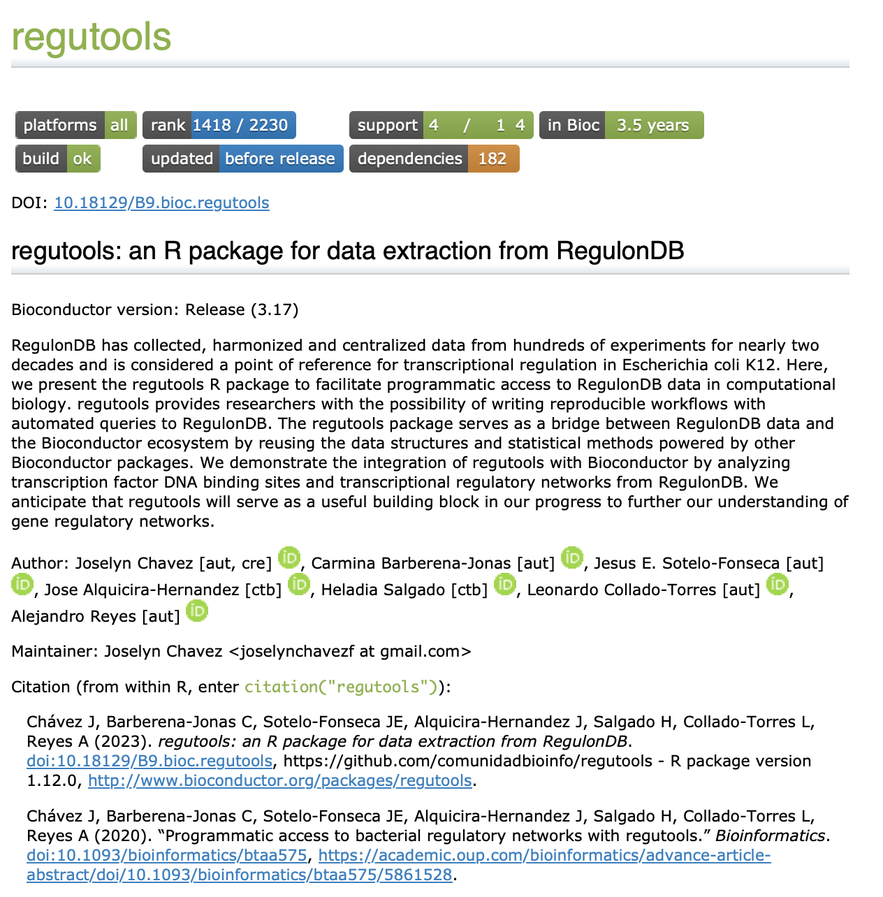

# Creación de viñetas

José Antonio Ovando Ricárdez

05 de agosto de 2025

<style>

div.color { 
border-radius: 5px; 
padding: 20px;
margin: 30px 0px 30px;}

div.red { background-color:#f67155; }

div.orange{ background-color:#f0BB51;}

div.pair { 	
display: flex;
flex-direction: row;
justify-content: center;
text-align:center;
padding:0px}

div.inside { width: 49%; padding: 0px}

div.scroll { 
max-height: 400px; 
overflow-y: auto; 
background: #111111;
border-radius:5px;
padding: 10px;
margin: 30px 0px 30px;
color: #999999;}

div.alert{color:#bd475d; background-color:transparent}
</style>


## ¿Qué es una viñeta/vignette? 📝✨

Es una guía extendida sobre cómo funciona el paquete. Es recomendable que muestre cómo utilizar las funciones del paquete, aplicado en un flujo de trabajo; por ejemplo: el análisis estadístico de una encuesta 📊 o el análisis de expresión diferencial de genes.

Podemos estructurarlo como haríamos con la escritura de un capítulo de libro o de un artículo científico: debe mostrar el problema a resolver y la metodología paso a paso sobre cómo el paquete lo resuelve.

Si el paquete contiene funciones que se complementan entre sí para alcanzar un fin específico, entonces debes mostrar su uso de forma compartamentalizada. 

## Características de una vignette 🌟

- Debe mostrar un flujo de análisis explotando el potencial de tu paquete 📊🚀.
- Implementa tantas funciones de tu paquete como sea posible, pero no es necesario que incluya todas 🛠️✨.
- Los datos a usar deben ser pequeños o fáciles de acceder 📂🔍.
- Puedes crear múltiples viñetas para mostrar diferentes casos de análisis y cubrir una mayor cantidad de funciones 📝📚.

## ¿Cómo consultar la viñeta de un paquete? ❓🔍

```{r, eval=FALSE}
browseVignettes(package = "ggplot2")
```

## ¿Cómo crear una viñeta? ❓🔍

```{r, eval=FALSE}
biocthis::use_bioc_vignette("mi_vignette")
```

Esta función tendrá tres efectos ✨:

- Generar el directorio **vignettes** en caso que no exista 📂🔧.
- Agregar dependencias en el archivo **DESCRIPTION** (por ejemplo, _knitr_ necesario para construir viñetas dentro del paquete) 📄📦.
- Abrir un template en formato **.Rmd** para comenzar a escribir la viñeta, que se va a guardar en **vignettes/mi_vignette.Rmd** 📝💾.

## ¿Cómo guardar y actualizar la viñeta? 🔄💻

Una vez que se ha generado el archivo **vignettes/mi_vignette.Rmd**, se hacen las modificaciones necesarias. Puedes usar el comando:

```{r, eval=FALSE}
edit_file("vignettes/mi_vignette.Rmd")
```

Para guardar los cambios, debes hacer clic en el botón **Knit** o utiliza la combinación de teclas **Ctrl/Cmd-Shift-K** 💾✨.

## Veamos un ejemplo 🔍👨‍💻

Busca la viñeta del paquete **regutools** en la página de Bioconductor 🌐:

[Viñeta de regutools en Bioconductor](https://bioconductor.org/packages/release/bioc/html/regutools.html) 📦📄

```{r, echo=FALSE, fig.align='center', out.width='50%'}

```

## Actividad

<div class = "orange color">

### Ejercicio 1: Identificación de viñetas en paquetes de interés en Bioconductor 📚🔍

- En equipos selecciona dos paquetes almacenados en Bioconductor que sean de tu interés y responde las siguientes preguntas:

  - ¿Ambos paquetes incluyen viñetas? 📝❓
  
  - ¿Qué aspectos de la viñeta del paquete A versus el paquete B te llaman más la atención? 🔍🤔
  
  - ¿Consideras que alguna viñeta está mejor desarrollada que la otra? Explica por qué 💭📊.

</div>

<div class = "orange color">

### Ejercicio 2: Creación de viñetas en R 🛠️📄

Pasos:

1. Cargar los paquetes necesarios

```{r}
library(usethis)
library(biocthis)
```

2. Crear un nuevo paquete de R (si no tienes uno ya creado)

```{r, eval=FALSE}
usethis::create_package("CDSB2024")
```

3. Configurar el paquete para Bioconductor

Ejecuta el siguiente comando para configurar el paquete con las mejores prácticas de Bioconductor:

```{r, eval=FALSE}
biocthis::use_bioc_pkg_templates()
```

Esto agregará varios archivos de configuración y plantillas útiles para trabajar con Bioconductor.

4. Crear una viñeta con biocthis

Ejecuta el siguiente comando para agregar una viñeta en formato R Markdown. Cambia "mi_vignette" por el título de la viñeta que prefieran.

```{r, eval=FALSE}
usethis::use_vignette("mi_vignette_usethis")
biocthis::use_bioc_vignette("mi_vignette_biocthis")
```

Esto creará un archivo R Markdown en la carpeta vignettes/ dentro del paquete.

5. Editar la viñeta

Abre el archivo creado en vignettes .Rmd. Incluye contenido que describa una función del paquete.

6. Abrir la viñeta en el navegador y renderiza el archivo .Rmd

```{r, eval=FALSE}
browseVignettes("CDSB2024")
```

</div>

### Preguntas de Reflexión 🤔💭

- ¿Cuál es la ventaja de documentar ejemplos de uso en una viñeta? 📚✨
  
- ¿Qué estructura consideras útil para presentar ejemplos en una viñeta? 🏗️🔍
  
- ¿Cómo aplicarías esta clase en tu proyecto colaborativo? 🤝📈

