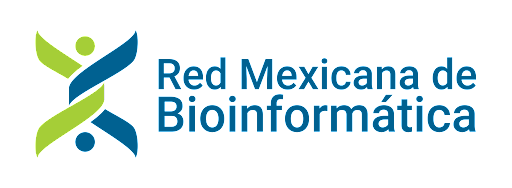

# Workshop CDSB 2024: Desarrollo de paqueterías de R/Bioconductor.

## 28-31 de octubre de 2024

Les damos la bienvenida al Workshop Desarrollo de paqueterías de R/Bioconductor! 

Nos da gusto anunciar que la CDSB, junto con la Red Mexicana de Bioinformática (RMB) y el Nodo Nacional de Bioinformática en la UNAM (NNB-CCG), está organizando el taller Desarrollo de paqueterías de R/Bioconductor como parte del Encuentro Nacional de Bioinformática México 2024.

Todas las sesiones serán teóricas y prácticas. Nos enfocaremos en dos temas principales: 

- Creación de paquetes de R/Bioconductor
- Generación de sitios web para la documentación de paquetes de R

[**¡Registrate aquí!**](https://www.nnb.unam.mx/EBM2024/registro/)

## Instructores

- [Dra. Joselyn Cristina Chávez Fuentes](https://comunidadbioinfo.github.io/es/authors/josschavezf/): Estancia Postdoctoral en Icahn School of Medicine at Mount Sinai.
- [Dra. Alejandra Medina Rivera](https://comunidadbioinfo.github.io/es/authors/amedina/): Investigadora Asociada en el Laboratorio Internacional de Investigación de Medicina Genómica, UNAM. 
- [Dra. Yalbi I. Balderas-Martínez](https://comunidadbioinfo.github.io/es/authors/yalbibalderas/): Investigadora en el Instituto Nacional de Enfermedades Respiratorias Ismael Cosío Villegas.
- [Dra. Mirna Vázquez Rosas Landa](https://comunidadbioinfo.github.io/es/authors/mirnavrl/): Investigadora en el Instituto de Ciencias de Mar y Limnología de la UNAM.
- [M.C. Erick Cuevas Fernández](https://comunidadbioinfo.github.io/es/authors/erickcufe/): Estudiante de Doctorado en la Universidad Nacional Autónoma de México.
- [M.C. José Antonio Ovando Ricárdez](https://comunidadbioinfo.github.io/es/authors/joseovando/)

## Ayudantes

- [Dra. Evelia Coss](https://github.com/EveliaCoss): Posdoctoral en el Laboratorio Internacional de Investigación de Medicina Genómica, UNAM. 

## Temario 

Consulta el calendario de este curso en: <http://bit.ly/calendarcdsb2024>

- Día 1: Flujo de trabajo orientado a proyectos:
  - Introducción al trabajo con proyectos de RStudio.
  - Paths seguros.
  - Control de versiones con GitHub y RStudio. 
  - Solución de problemas con las versiones de paquetes de Rstudio.

- Día 2: Creación de paquetes de R/Bioconductor Parte I
  
  - Infraestructura de un paquete de R/Bioconductor.
  - Documentación de funciones.
  - Sesión social: Conociendo a la comunidad.
  - Proyectos colaborativos Parte I.

- Día 3: Creación de paquetes de R/Bioconductor Parte II
  - Diseño de pruebas.
  - Creación de viñetas.
  - Compilación e instalación de paquetes.
  - Proyectos colaborativos Parte II.

- Día 4: Creación de sitios web para la documentación de paquetes de R
  - Creación de sitios web con pkgdown 
  - Proyectos colaborativos Parte III. 
  - Presentación de proyectos.
  - Clausura.

# Materiales

Puedes consultar el libro electrónico en: https://comunidadbioinfo.github.io/cdsb2024/

# Patrocinadores

Agradecemos el apoyo de:

