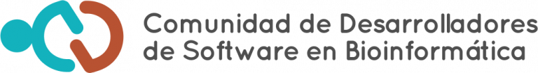

# Workshop CDSB 2025: Creación de paquetes de R/Bioconductor para el análisis de metagenomas.

## 04-08 de octubre de 2025

Les damos la bienvenida al Workshop Creación de paquetes de R/Bioconductor para el análisis de metagenomas! 

Nos da gusto anunciar que la CDSB, junto con la Red Mexicana de Bioinformática (RMB) y el Nodo Nacional de Bioinformática en la UNAM (NNB-CCG), está organizando el taller Desarrollo de paqueterías de R/Bioconductor como parte del Encuentro Nacional de Bioinformática México 2024.

Todas las sesiones serán teóricas y prácticas. Nos enfocaremos en dos temas principales: 

- Análisis de metagenomas
- Creación de paquetes de R/Bioconductor

[**¡Registrate aquí!**](https://www.nnb.unam.mx/EBM2025/registro/)

## Instructores

- [Dra. Mirna Vázquez Rosas Landa](https://comunidadbioinfo.github.io/es/authors/mirnavrl/): Investigadora en el Instituto de Ciencias de Mar y Limnología de la UNAM.
- [Dra. Joselyn Cristina Chávez Fuentes](https://comunidadbioinfo.github.io/es/authors/josschavezf/): Estancia Postdoctoral en Icahn School of Medicine at Mount Sinai.
- [Dra. Yalbi I. Balderas-Martínez](https://comunidadbioinfo.github.io/es/authors/yalbibalderas/): Investigadora en el Instituto Nacional de Enfermedades Respiratorias Ismael Cosío Villegas.
- [M.C. Erick Cuevas Fernández](https://comunidadbioinfo.github.io/es/authors/erickcufe/): Estudiante de Doctorado en la Universidad Nacional Autónoma de México.
- [M.C. José Antonio Ovando Ricárdez](https://comunidadbioinfo.github.io/es/authors/joseovando/)

## Ayudantes

## Temario 

Consulta el calendario de este curso en: <http://bit.ly/calendarcdsb2025>

- Día 1: Estructura general de un paquete
  - Presentación a la CDSB.
  - Plática: La última versión del árbol de la vida y la metagenómica.
  - Control de versiones con GitHub y RStudio.
  - Creando la infraestructura de un paquete.

- Día 2:  Documentación de un paquete 
  - Creando mis primeras funciones.
  - Documentación de funciones.
  - Diseño de pruebas.
  - Creación de viñetas.
  - Introducción a Conda

- Día 3: Reconstrucción de genomas
  - El grupo de datos.
  - Mapeo y Binning.
  - Asignación taxonómica.

- Día 4: Reconstrucción metabólica e inferencia filogenética
  - Análisis de vías metabólicas. 
  - MEBs (Multigenomic Entropy Based Score pipeline ) 
  - Proyectos colaborativos de metagenomas.

- Día 5:
  - Proyectos colaborativos de metagenomas.
  - Presentación de proyecto.
  - Clausura.

# Materiales

Puedes consultar el libro electrónico en: https://comunidadbioinfo.github.io/cdsb2025/

# Patrocinadores

Agradecemos el apoyo de:

